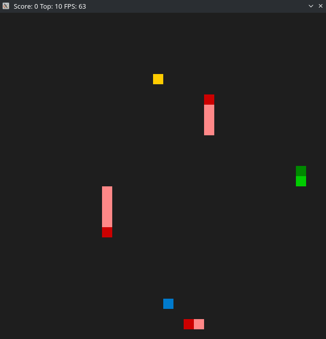

# C++ Nanodegree Capstone: Snake Game

## Table of Contents
- [Project Description](#project-description)
- [Dependencies](#dependencies)
- [Build Instructions](#build-instructions)
- [Run Instructions](#run-instructions)
- [File & Class Structure](#file--class-structure)
- [Features & Expected Behavior](#features--expected-behavior)
- [Rubric Points Addressed](#rubric-points-addressed)


## Project Description
This is an implementation of the classic **Snake Game**, developed as the capstone project for the Udacity C++ Nanodegree Program. The project is based on the Udacity [starter code repository](https://github.com/udacity/CppND-Capstone-Snake-Game), which in turn was inspired by [this Stack Overflow post](https://stackoverflow.com/questions/21711796/simple-snake-game-in-c) and its set of responses. The code has been significantly expanded and enhanced for the capstone. This implementation if the game features:
- A player-controlled snake and a computer-controlled snake (called AISnake, that is driven by an A* Search based algorithm) that both actively navigating a 2D grid competing for food.
- Moving obstacles (ObstacleSnakes) and randomly placed food.
- Health and score tracking with persistent high scores.

A 2D Snake game developed in modern C++ with SDL2, created as the final capstone project for the Udacity C++ Nanodegree program. The project demonstrates core C++ concepts including object-oriented programming, real-time input handling, pathfinding base on A* search algorithm, persistent file I/O, and multithreading. This README reflects the current code in the `master` branch of the repository and explains how the CppND Capstone Snake Game code satisfies the Udacity Nanodegree rubric for the following sections: **README**, **Compiling and Testing**,  **Loops, Functions, I/O**, **Object Oriented Programming**, **Memory Management**, and **Concurrency**.

## Screenshot



## Dependencies
* cmake >= 3.7
  * All OSes: [click here for installation instructions](https://cmake.org/install/)
* make >= 4.1 (Linux, Mac), 3.81 (Windows)
  * Linux: make is installed by default on most Linux distros
  * Mac: [install Xcode command line tools to get make](https://developer.apple.com/xcode/features/)
  * Windows: [Click here for installation instructions](http://gnuwin32.sourceforge.net/packages/make.htm)
* SDL2 >= 2.0
  * All installation instructions can be found [here](https://wiki.libsdl.org/Installation)
  >Note that for Linux, an `apt` or `apt-get` installation is preferred to building from source. 
* gcc/g++ >= 5.4
  * Linux: gcc / g++ is installed by default on most Linux distros
  * Mac: same deal as make - [install Xcode command line tools](https://developer.apple.com/xcode/features/)
  * Windows: recommend using [MinGW](http://www.mingw.org/)

## Build Instructions
```bash
git clone https://github.com/terayerhan/CppND-Capstone-Snake-Game.git
cd CppND-Capstone-Snake-Game
mkdir build && cd build
cmake .. && make
```

## Run Instructions
From the `build/` directory:
```bash
./SnakeGame
```
#### How to Play:

- Use the arrow keys to control the blue snake (player).
- Eat the yellow food to grow longer and increase your score.
- Avoid collisions with walls, your own body, AI snake, and dynamic obstacle snakes.
- Your score and all-time top score are displayed in the window title.

## File & Class Structure
```
CppND-Capstone-Snake-Game/
├── CMakeLists.txt
├── src/
│   ├── main.cpp                   # Program entry point (Grid setup, Game loop)
│   ├── controller.h/.cpp          # Input handling
│   ├── game.h/.cpp                # Game engine and logic
│   ├── renderer.h/.cpp            # SDL rendering code
│   ├── snake.h/.cpp               # Base Snake class
│   ├── snakes.h/.cpp              # Player, AI and Obstacle snakes subclasses
│   ├── top_score_manager.h/.cpp   # High-score persistence (file I/O)
│   ├── grid.h                     # Grid and position management
│   ├── sdl_point_operators.h/.cpp # SDL_Point helpers
│   ├── Types.h                    # Common enums and type aliases 
│   ├── food.h                     # Food entity
│   └── Entity.h                   # Abstract Entity base class

```
#### Class Hierarchy

```
Entity (Abstract class)
├── Food
└── Snake (Abstract base snake class)
    ├── PlayerSnake
    ├── AISnake
    └── ObstacleSnake

Game (composes PlayerSnake, AISnake, ObstacleSnake, Food, Grid, Renderer, Controller)
Renderer
Controller
TopScoreManager
Grid
Node (used in A* pathfinding)
```

## Features & Expected Behavior
- **Game Loop:** Runs at a fixed frame rate (60 FPS by default), handling input, update, and render each cycle.
- **Player Controls:** Arrow keys to change snake direction; invalid reversals are ignored.
- **AI Snake:** Follows the food using A* search based pathfinding, re-planning when food is eaten or player changes direction.
- **Obstacles:** Multiple non-player snakes move autonomously and penalize collisions.
- **Food Mechanics:** Food appears in empty cells; growth and speed-up on consumption.
- **Scoring:** Score equals snake length minus one; top score loaded at start and saved asynchronously on new records.
- **Game Over:** Occurs when player health depletes; window title displays “Game Over.”

## Rubric Points Addressed

### README 
---
- **Instructions Included:** Build and Run instructions are in this README (see [Build Instructions](#build-instructions) and [Run Instructions](#run-instructions)).
- **Project Chosen:** Snake Game capstone, described in [Project Description](#project-description).
- **File/Class Structure & Behavior:** Detailed in [File & Class Structure](#file--class-structure) and [Features & Expected Behavior](#features--expected-behavior).
- **Rubric Coverage:** Each rubric section below indicates file where requirements are implemented.
---

### Compiling and Testing
---
- **Compiles & Runs:** Verified with `cmake` and `make` on Linux (CMakeLists.txt). All code compiles without warnings on g++ 13.3.
---
## Loops, Functions, I/O

- **Functions & Control Structures**: The project code is organized into clear, reusable functions such as `Game::Run`, `Game::Update`, and `Controller::HandleInput`, demonstrating a solid understanding of C++ functions and control flow (`src/game.cpp`, `src/controller.cpp`).
- **Variety of Control Structures**: The code uses `while` loops for the main game loop and A* search, `for` loops for iterating through snakes and collision checks, and `switch` statements in `Controller::HandleInput` and `ObstacleSnake::InitializeBody` to handle user input and body initialization (`src/main.cpp`, `src/snakes.cpp`).
- **I/O Operations**: Persistent high‐score management is implemented in `TopScoreManager`, which reads from (`std::ifstream`) and writes to (`std::ofstream`) an external file (`topscore.txt`) as part of normal program operation (`src/top_score_manager.cpp`, `src/top_score_manager.h`).
- **User Input**: Keyboard events (`SDL_KEYDOWN`) are captured in `Controller::HandleInput` to accept user input and update the player snake’s direction (`src/controller.cpp`).

---

## Object Oriented Programming

- **Class Organization**: The codebase defines multiple classes (`Game`, `Controller`, `Renderer`, `Snake`, and derived classes `PlayerSnake`, `AISnake`, `ObstacleSnake`, and `Food`), each encapsulating data and behavior relevant to its role (`src/game.h`, `src/snake.h`, `src/snakes.h`, `src/entity.h`).
- **Access Specifiers**: All class members are explicitly marked `public`, `protected`, or `private`, ensuring proper encapsulation (e.g., `Snake` exposes only necessary interface methods publicly, hides internal state privately) (`src/snake.h`).
- **Constructors & Initialization Lists**: Classes use member initialization lists extensively to initialize attributes (`Game`, `Snake`, `AISnake` all perform member‐by‐member initialization) (`src/game.cpp`, `src/snake.h`).
- **Abstraction & Encapsulation**: Rendering, input handling, and game logic are separated into `Renderer`, `Controller`, and `Game`, respectively, abstracting implementation details and presenting clean interfaces (`src/main.cpp`, `src/controller.cpp`).
- **Inheritance Hierarchy**: `Snake` serves as a base class with shared functionality; `PlayerSnake`, `AISnake`, and `ObstacleSnake` derive from it. `Game` composes these classes, demonstrating appropriate use of inheritance and composition (`src/snake.h`, `src/snakes.h`).
- **Function Overloading & Overriding**: Methods like `Accelerate()` and `Accelerate(float)` are overloaded in `Snake`, while virtual functions such as `Grow()` and `ReduceHealth()` are overridden in derived classes to customize behavior (`src/snake.h`, `src/snakes.cpp`).


---

## Memory Management

- **Pass-by-Reference**: Functions and constructors use references (`Grid&`, `Controller&`, `PlayerSnake&`) to avoid unnecessary copies and manage object lifetimes efficiently (`src/main.cpp`, `src/controller.cpp`).
- **Destructors & RAII**: Resource‐managing types (`std::ifstream`, `std::mt19937`, `SDL` wrappers) rely on RAII for cleanup. Classes like `Snake` and its derivatives use default destructors (`~Snake() override = default`) appropriately (`src/top_score_manager.cpp`, `src/snake.h`).
- **Smart Pointers**: `std::shared_ptr<Node>` is employed in A* pathfinding to manage node lifetimes automatically; no raw owning pointers are used for heap‐allocated data (`src/snakes.cpp`).
- **Rule of Five**: The `Snake` class defines a custom copy assignment operator and relies on default move operations and destructor, fitting the Rule of Five where necessary for correct copy semantics (`src/snake.h`).

---

## Concurrency

- **Multithreading**: Background tasks are executed via `std::async` in both `Game::Run` (saving top scores), `AISnake::PredictSnakesBlockedCells()` and `AISnake::FindPath` (parallel node expansion), demonstrating use of multiple threads in execution (`src/game.cpp`, `src/snakes.cpp`).
  - `AISnake::PredictSnakesBlockedCells()` runs as a concurrent task using `std::async`, enabling parallel prediction of blocked paths (`snakes.cpp`).
  - In `AISnake::FindPath()` (`snakes.cpp`), concurrency is utilized to parallelize expansion of A* pathfinding:
    - Each possible movement direction spawns an asynchronous call to `AddNode()` via `std::async`.
    - These tasks concurrently generate path nodes and insert them into a shared `openList`, protected by a `std::mutex`.
    - The futures are collected in a `std::vector<std::future<void>>` and synchronized with `.wait()` to ensure thread safety and completion.
    - This improves pathfinding responsiveness, especially under time constraints.

- **Futures**: `std::future` objects returned by `std::async` are used to synchronize background operations (`future.wait()`), fulfilling the promise/future mechanism for thread communication (`src/game.cpp`, `src/snakes.cpp`).
- **Mutexes**: `std::mutex` instances (`openListMutex`, `_pathMutex`) are declared and passed to pathfinding functions to protect shared data structures in concurrent contexts (`src/game.h`, `src/snakes.cpp`).


---

This README demonstrates how the CppND Capstone Snake Game project adheres to the specified rubric by showcasing structured functions, class abstractions, safe memory practices, and concurrent operations where appropriate.


## License

This project is licensed under the [CC BY-SA 4.0 License](LICENSE.md).

## Author

**terayerhan** — [GitHub Profile](https://github.com/terayerhan)